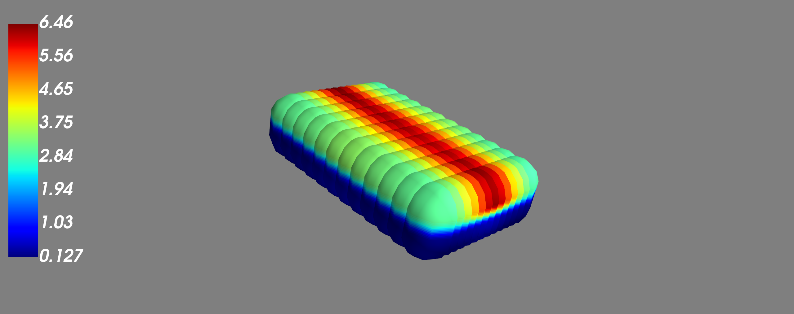

# Resistivity Viewer



Este projeto é um programa de visualização 3D e 2D de dados de resistividade. Ele permite visualizar os dados em um ambiente 3D interativo e também em planos XY, XZ e YZ. Além disso, é possível personalizar a escala de cores para uma interpretação visual eficiente.

## Instalação

Certifique-se de ter o Python instalado. Você pode verificar a versão do Python em seu sistema executando o seguinte comando no terminal:

1.Clone este repositório em seu ambiente local:

```
git clone https://github.com/LeandroSeabra/Resistivity_Viewer.git
```

2.Acesse o diretório do projeto:

```
cd Resistivity_Viewer
```

3.Instale as dependências necessárias executando o seguinte comando:
```
pip install -r requirements.txt
```

## Uso
Execute o programa principal main.py para visualizar :

```
python ResistivityViewer.py
```
O programa abrirá uma visualização 3D dos dados de resistividade e permitirá que você navegue pelo ambiente 3D. Além disso, você pode plotar os planos XY, XZ e YZ para analisar os dados em 2D.

## Licença
Este projeto está licenciado sob [Inserir Nome da Licença]. Consulte o arquivo LICENSE para obter mais informações.

## Contato

Se você tiver alguma dúvida ou sugestão, entre em contato por e-mail em [leandro.seabra27@gmail.com].
